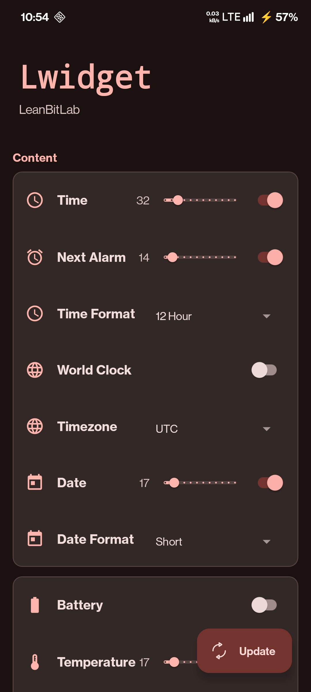

# Lwidget

<picture>
  <source media="(prefers-color-scheme: dark)" srcset="docs/images/banner_dark.svg">
  <source media="(prefers-color-scheme: light)" srcset="docs/images/banner_light.svg">
  
</picture>

  

**Lwidget** is a modern, open-source Android widget built with **Kotlin** and **Material 3** design principles. It provides essential information at a glance while adhering to your device's dynamic theme.

## Screenshots

<table>
  <tr>
    <td></td>
    <td></td>
    <td></td>
    <td></td>
    <td></td>
  </tr>
</table>

## Features

-   **Material You**: Full dynamic color support.
-   **Configurable**: Adjust text sizes and visibility for all elements.
-   **Time & Date**: Clear, customizable display.
-   **Battery & Temperature**: Real-time device status.
-   **Calendar Events**: Upcoming agenda at a glance.
-   **Task Integration**: Seamless integration with [Tasks.org](https://tasks.org/).
-   **World Clock**: Track time in another zone.
-   **Next Alarm**: Display your next scheduled alarm.
-   **Daily Data Usage**: Monitor your daily data consumption.
-   **Internal Storage**: Monitor available device storage.
-   **Custom Formats**: Choose your preferred Time and Date formats.
-   **Light/Dark Mode**: Optimized contrast for readability.
-   **Privacy Focused**: No internet permission required.
-   **Accent Outline**: Adds a stylish border to the widget.
-   **Improved Settings**: Refined settings interface for better usability.
-   **Manual Transparency**: Fine-tune the widget's background transparency.
-   **Custom Colors**: Choose between Default, System Accent, or Custom colors for text.
-   **Outline Color**: Customize the widget outline color.

## Download

You can download the latest release from the [GitHub Releases](https://github.com/LeanBitLab/Lwidget/releases) page.

## Setup

-   **Permissions**: The widget requires `Calendar` permission to display upcoming events. It will prompt you when needed.
-   **Battery Optimization**: For reliable updates, ensure battery optimization is disabled for Lwidget.

## License

Lwidget is licensed under **GNU General Public License v3.0**.

See [LICENSE](LICENSE) file.

## Credits

-   Built with ❤️ by [LeanBitLab](https://github.com/LeanBitLab)

## Support the Development

Building and maintaining open-source apps takes time and resources. If you love Lwidget, please consider supporting the project!

Your support keeps the code **100% Free and Open Source**.

---

*Lwidget • Modern Material You Widget*
